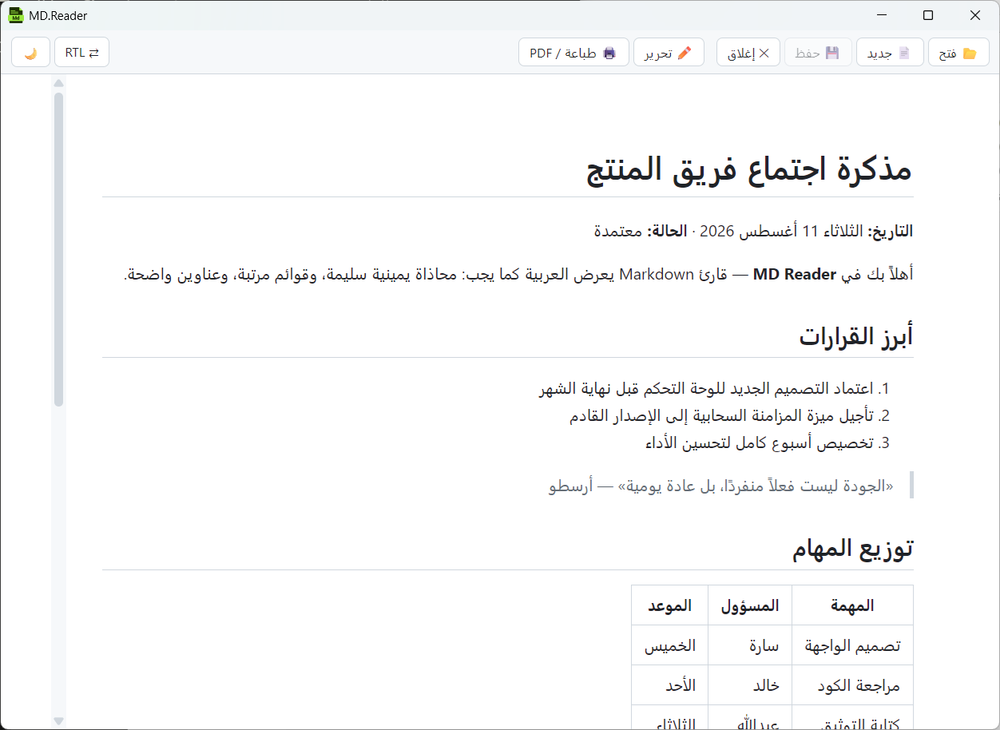
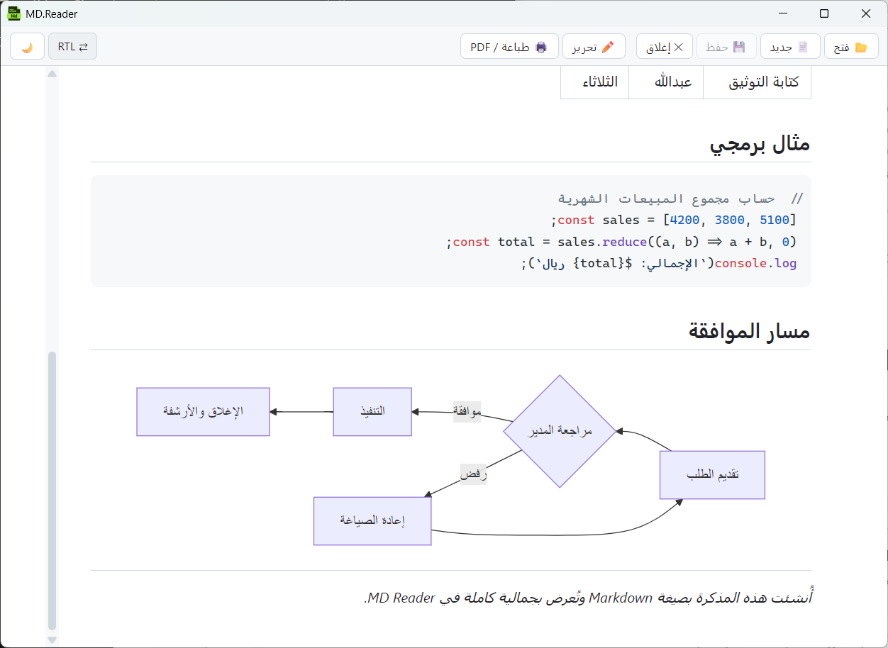
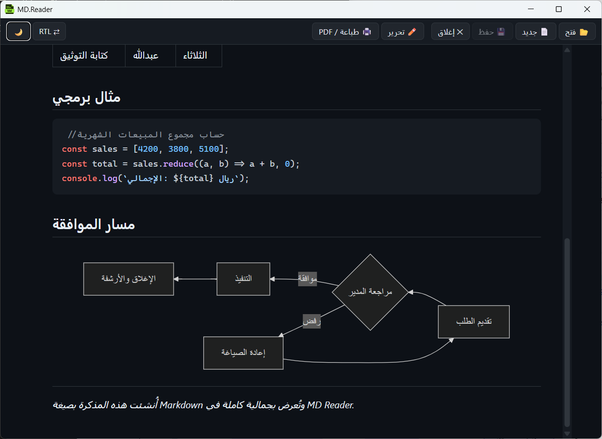
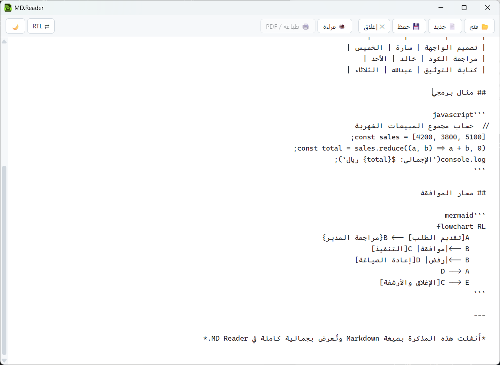

  

<h1 align="center">MD Reader Arabic</h1>

  <b>أخيرًا… قارئ ومحرر Markdown يعرض العربية كما يجب.</b> 
  اتجاه RTL سليم، وضع ليلي، مخططات Mermaid، وطباعة بضغطة واحدة — خفيف، سريع، ويعمل بلا إنترنت.

  

  <b>العربية</b> · <a href="README.en.md">English</a>

  

## لماذا MD Reader؟

معظم قارئات Markdown تتعامل مع العربية كأنها لغة طارئة: محاذاة مكسورة، اتجاه خاطئ، وقوائم وجداول مبعثرة. **MD Reader** بُني من أول سطر للعربية؛ تفتح الملف فيظهر كما كتبته: عناوين واضحة، قوائم مرتبة، وجداول تبدأ من اليمين. وإذا كان المحتوى إنجليزيًا، فزر واحد يقلب الاتجاه.

مناسب لقراءة ملفات التوثيق، والملاحظات، ومخرجات أدوات الذكاء الاصطناعي بصيغة Markdown — بالعربية أو الإنجليزية.

## المميزات

| | الميزة | ماذا تعني لك |
|---|---|---|
| ↔️ | **عربية أولًا (RTL)** | اتجاه صحيح في القراءة والتحرير، مع تبديل الاتجاه بضغطة زر |
| 👁️ | **وضعان منفصلان** | قراءة منسّقة أنيقة (الافتراضي) وتحرير مباشر — تنقّل بينهما بـ `Ctrl+E` |
| 📊 | **مخططات Mermaid** | تُرسم داخل المستند مباشرة، مع تكبير وسحب مستقل لكل مخطط |
| 🌙 | **وضع ليلي** | مريح للعين، ويشمل الأكواد والمخططات |
| 🎨 | **تلوين الأكواد** | JavaScript وTypeScript وPython وRust وBash وJSON وHTML وCSS وغيرها |
| 🔍 | **تكبير وتصغير** | `Ctrl` مع `+` / `-` أو عجلة الفأرة، مع حفظ درجة التكبير |
| 🖨️ | **طباعة / PDF** | اطبع المستند المنسّق أو احفظه PDF بـ `Ctrl+P` |
| 💾 | **حفظ تلقائي** | لا تفقد ما كتبت، والتطبيق يفتح آخر ملف عند التشغيل |
| 📂 | **فتح باستخدام** | افتح ملفاتك مباشرة من مستكشف الملفات |
| 🔒 | **خصوصية تامة** | يعمل محليًا بالكامل: بلا إنترنت، بلا حسابات، بلا إعلانات |

## لقطات من التطبيق

### مخططات Mermaid وأكواد ملوّنة

  

### الوضع الليلي

  

### وضع التحرير

  

## الملفات المدعومة

| النوع | الامتدادات |
|---|---|
| مستندات Markdown | `.md` · `.markdown` · `.mdc` |
| مخططات Mermaid | `.mermaid` · `.mmd` |

## اختصارات لوحة المفاتيح

تعمل الاختصارات حتى مع تخطيط لوحة المفاتيح العربي.

| الاختصار | الوظيفة |
|---|---|
| `Ctrl+O` | فتح ملف |
| `Ctrl+S` | حفظ |
| `Ctrl+E` | التبديل بين القراءة والتحرير |
| `Ctrl+P` | طباعة / PDF (في وضع القراءة) |
| `Ctrl+W` | إغلاق المستند |
| `Ctrl` و `+` / `-` | تكبير / تصغير |
| `Ctrl+0` | إعادة التكبير إلى 100% |
| `Ctrl` + عجلة الفأرة | تكبير / تصغير |

## التثبيت

احصل على التطبيق من متجر مايكروسوفت لنظام ويندوز:

  

## الخصوصية

التطبيق لا يجمع أي بيانات ولا يتصل بالإنترنت. ملفاتك تبقى على جهازك.

[سياسة الخصوصية](https://adulash.github.io/mdreader/privacy-policy.html)

